# Unified Markdown Showcase

이 파일은 사이드바 최근 목록의 마지막 예제 채팅방을 선택했을 때 표시되는 `public/samples/markdown-showcase.md` 샘플입니다. 웹/Android WebView 공통 렌더링 검증을 위해 **KaTeX/LaTeX, code block, table wrapper, 외부 링크, Mermaid**와 조합 예제를 50가지로 구성했습니다.

## 01. 기본 제목/문단

일반 문단입니다. **굵게**, *기울임*, `inline code`를 함께 사용합니다.

## 02. 줄바꿈과 강조

첫 번째 줄입니다.  
두 번째 줄입니다.

> 인용문도 markdown으로 표현됩니다.

## 03. 순서 없는 목록

- Vue 3
- Unified
- WebView
- Markdown Renderer

## 04. 순서 있는 목록

1. Markdown 입력
2. Unified 처리
3. HTML 변환
4. Vue `v-html` 렌더링

## 05. 체크리스트

- [x] KaTeX 적용
- [x] Code block 적용
- [x] Table wrapper 적용
- [x] 외부 링크 적용
- [x] Mermaid 후처리 적용

## 06. 외부 링크

공식 문서 링크: https://unifiedjs.com

## 07. Markdown 링크

[Vue 공식 문서](https://vuejs.org)와 [KaTeX 공식 문서](https://katex.org)를 새 창으로 엽니다.

## 08. Inline LaTeX

질량-에너지 등가식은 $E = mc^2$ 입니다.

## 09. Block LaTeX

$$
\int_0^1 x^2 dx = \frac{1}{3}
$$

## 10. 여러 수식 조합

Inline: $a^2 + b^2 = c^2$  
Block:

$$
\sum_{i=1}^{n} i = \frac{n(n+1)}{2}
$$

## 11. JavaScript 코드 블록

```js
const renderPipeline = ['remark', 'rehype', 'html']
console.log(renderPipeline.join(' -> '))
```

## 12. TypeScript 코드 블록

```ts
type MessageRole = 'user' | 'assistant'
interface ChatMessage {
  id: string
  role: MessageRole
  content: string
}
```

## 13. Vue 코드 블록

```vue
<template>
  <div class="markdown-body" v-html="html"></div>
</template>
```

## 14. Java 코드 블록

```java
public class MarkdownResponse {
    private String content;
}
```

## 15. SQL 코드 블록

```sql
SELECT id, role, content
FROM chat_message
ORDER BY created_at DESC;
```

## 16. Bash 코드 블록

```bash
npm install unified remark-parse remark-gfm remark-math remark-rehype
```

## 17. JSON 코드 블록

```json
{
  "renderer": "unified",
  "features": ["katex", "code", "table", "link", "mermaid"]
}
```

## 18. 코드 블록 + 설명

아래 코드는 `undefined` 또는 `null` 입력을 안전하게 빈 문자열로 처리합니다.

```js
function safeText(value) {
  return String(value ?? '')
}
```

## 19. 기본 표

| 기능 | 플러그인 | 상태 |
| --- | --- | --- |
| GFM | remark-gfm | 적용 |
| Math | remark-math | 적용 |
| KaTeX | rehype-katex | 적용 |

## 20. 긴 표 wrapper 검증

| 항목 | 매우 긴 설명 |
| --- | --- |
| WebView | Android WebView에서 가로 폭이 긴 표가 화면을 밀지 않고 `.md-table-wrapper` 내부에서 가로 스크롤되어야 합니다. |
| Desktop | PC Chrome에서는 표가 말풍선 너비 안에서 안정적으로 보여야 합니다. |

## 21. 표 + Inline Code

| 파일 | 역할 |
| --- | --- |
| `src/utils/markdown.js` | unified 파이프라인 |
| `src/utils/mermaidRenderer.js` | Mermaid DOM 후처리 |

## 22. 표 + 링크

| 문서 | 링크 |
| --- | --- |
| Unified | https://unifiedjs.com |
| Vue | https://vuejs.org |

## 23. Mermaid Flowchart

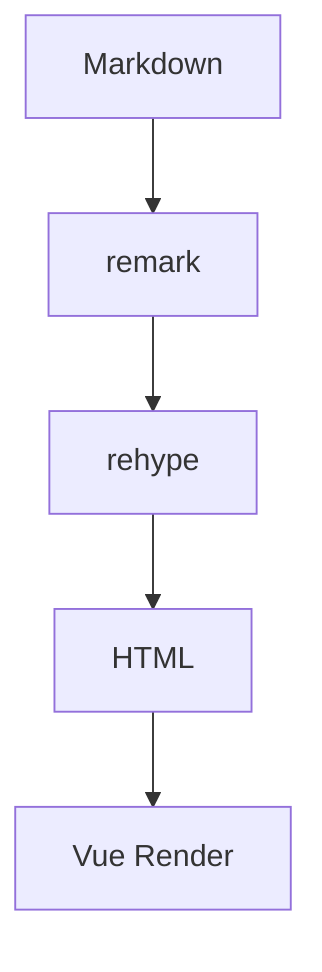

## 24. Mermaid Sequence

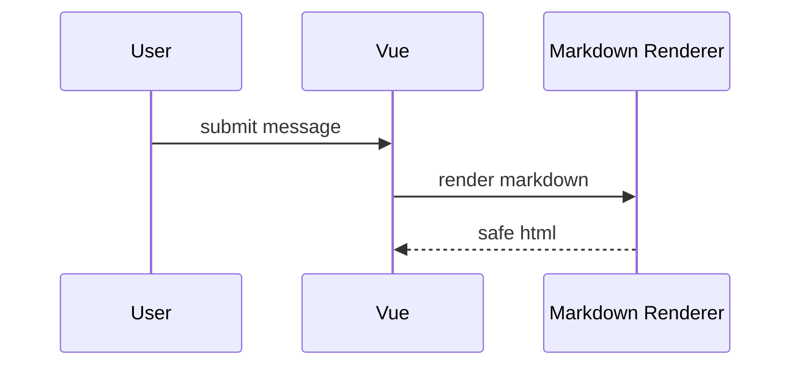

## 25. Mermaid State Diagram

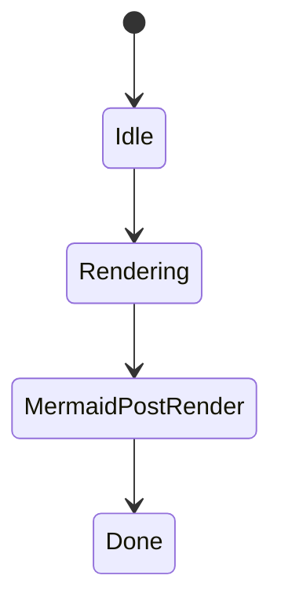

## 26. Mermaid Pie

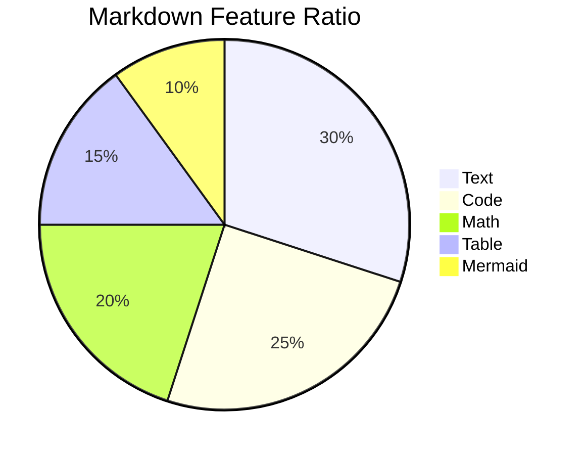

## 27. KaTeX + 표

| 공식 | 설명 |
| --- | --- |
| $E = mc^2$ | 에너지 공식 |
| $a^2 + b^2 = c^2$ | 피타고라스 정리 |

## 28. KaTeX + 코드

수식 $f(x)=x^2$를 코드로 표현하면 다음과 같습니다.

```js
const f = (x) => x ** 2
```

## 29. KaTeX + 외부 링크

KaTeX 문법은 https://katex.org 에서 확인할 수 있습니다. 예: $\sqrt{16}=4$.

## 30. Code + Table

| 언어 | 샘플 |
| --- | --- |
| JavaScript | `const a = 1` |
| Java | `String value = "A"` |

## 31. Code + External Link

아래 코드는 Vue 문서 링크를 포함합니다.

```js
const docs = 'https://vuejs.org'
window.open(docs, '_blank')
```

## 32. Code + Mermaid 설명

Mermaid는 `language-mermaid` 코드 블록을 DOM 후처리로 렌더링합니다.

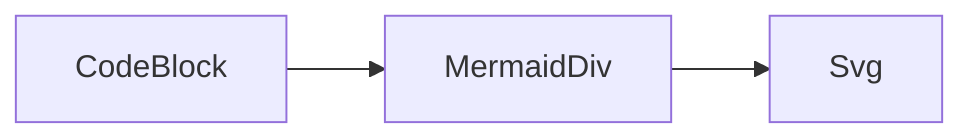

## 33. Table + Mermaid

| 단계 | 설명 |
| --- | --- |
| 1 | Markdown AST |
| 2 | HTML AST |
| 3 | Mermaid 후처리 |

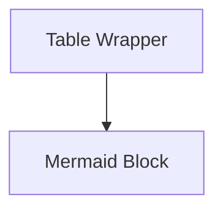

## 34. Link + Mermaid

외부 링크: https://github.com/unifiedjs/unified

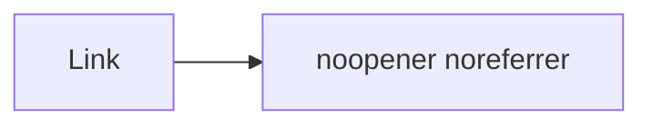

## 35. 긴 코드 블록 가로 스크롤

```js
const veryLongLine = '이 코드는 WebView에서 가로 스크롤이 정상 동작하는지 확인하기 위한 매우 긴 문자열입니다. 말풍선 밖으로 화면을 밀면 안 됩니다.'
```

## 36. HTML 입력 안전성

아래 문자열은 HTML로 실행되지 않고 일반 텍스트로 취급되어야 합니다.

<script>alert('xss')</script>

## 37. GFM 취소선

~~삭제된 요구사항~~ 대신 unified 기반 렌더링을 적용합니다.

## 38. Nested List

- Renderer
  - remark
  - rehype
- Post Process
  - Mermaid
  - Scroll

## 39. Blockquote + Code

> 운영 구조에서는 메시지 단위 렌더링을 권장합니다.

```js
await renderMarkdown(message.content)
```

## 40. Blockquote + Math

> 평균값 공식: $\bar{x} = \frac{1}{n}\sum x_i$

## 41. 한글 + 수식

한글 문장 사이에 수식 $\alpha + \beta = \gamma$가 정상 표시되어야 합니다.

## 42. 한글 + 코드

```js
const message = '한글 코드 블록 테스트'
console.log(message)
```

## 43. 한글 + 표

| 구분 | 내용 |
| --- | --- |
| 입력 | 사용자 질의 |
| 출력 | Assistant Markdown 응답 |

## 44. 한글 + Mermaid

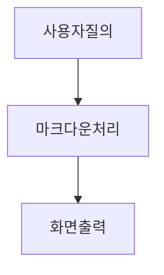

## 45. Inline Code + Link + Math

`renderMarkdown()`는 https://unifiedjs.com 기반이며 $x + y = z$도 처리합니다.

## 46. Code + Table + Link

| 코드 | 링크 |
| --- | --- |
| `npm run build` | https://webpack.js.org |

## 47. Math + Table + Mermaid

| 공식 | Mermaid |
| --- | --- |
| $F = ma$ | 아래 다이어그램 참고 |

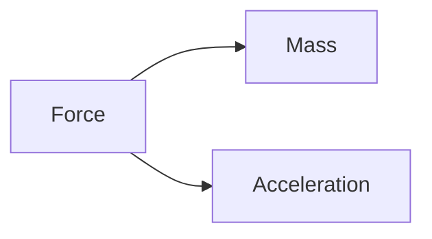

## 48. 복합 예제 1

- 링크: https://developer.mozilla.org
- 수식: $\log_2 8 = 3$
- 코드:

```ts
const enabled: boolean = true
```

## 49. 복합 예제 2

| 기능 | 예시 |
| --- | --- |
| Math | $\pi \approx 3.14$ |
| Code | `console.log('ok')` |
| Link | https://katex.org |

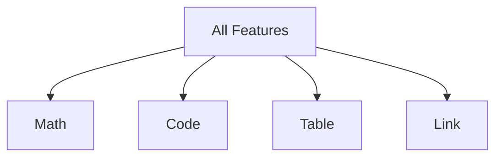

## 50. 최종 통합 예제

이 예제는 **텍스트**, `inline code`, 외부 링크 https://vuejs.org, 수식 $e^{i\pi}+1=0$, 표, 코드 블록, Mermaid를 모두 포함합니다.

| Layer | Description |
| --- | --- |
| remark | Markdown AST |
| rehype | HTML AST |
| Vue | UI Render |

```js
const pipeline = ['markdown', 'unified', 'html', 'mermaid']
console.log(pipeline)
```

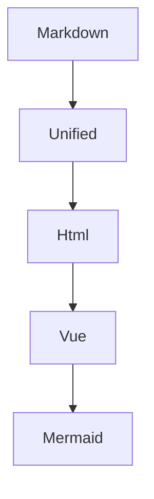
